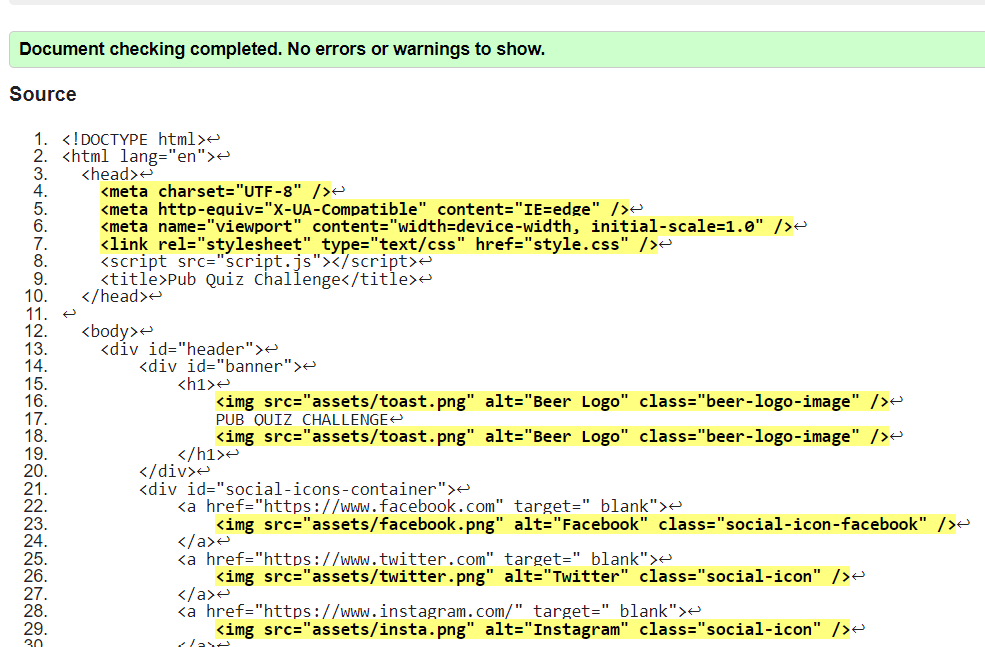
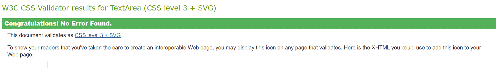
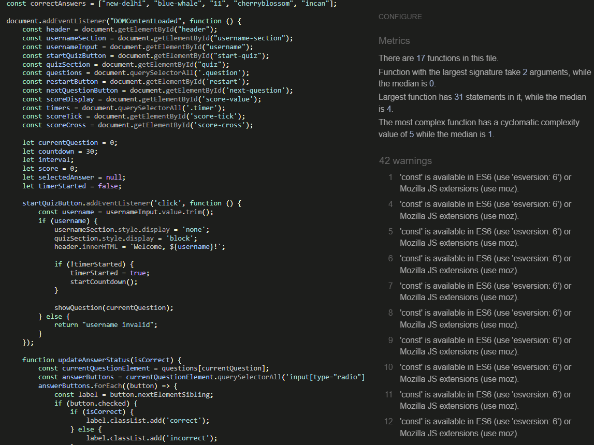
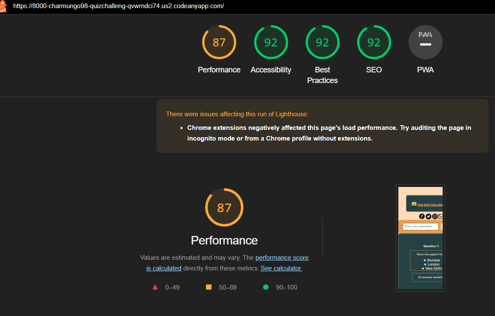
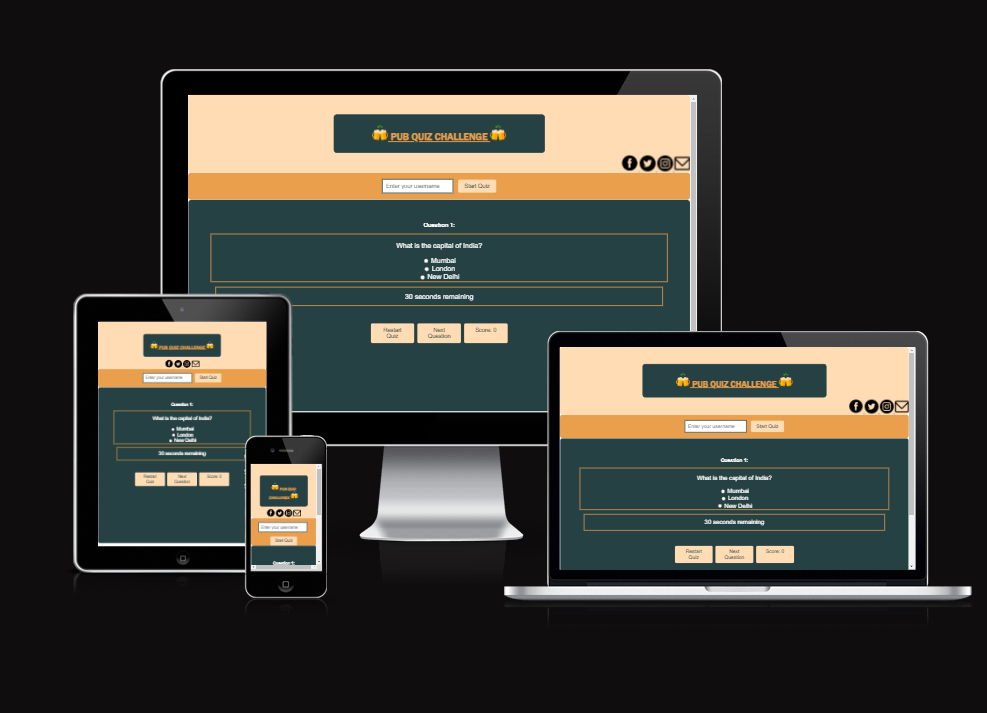

# Pub Quiz

- "Pub Quiz Challenge" is an engaging online platform that offers a collection of fun and informative quizzes. Test your knowledge on various topics and enjoy a delightful quiz experience. Whether you're a solo player or competing with friends, our quizzes are designed to entertain and educate. Dive into the world of trivia, learn something new, and challenge your brain with the Pub Quiz Challenge!

Visit the deployed website [here](https://charmungo98.github.io/QuizChallenge/).

## Table of Contents

- [Pub Quiz](#pub-quiz)
  - [Table of Contents](#table-of-contents)
- [1. User Experience (UX)](#1-user-experience-ux)
    - [User Experience](#user-experience)
    - [Color Scheme](#color-scheme)
    - [Fonts](#fonts)
- [2. Features](#2-features)
    - [General](#general)
- [3. Technologies Used](#3-technologies-used)
    - [Languages](#languages)
    - [Programs Used](#programs-used)
- [4. Testing](#4-testing)
    - [Testing UX](#testing-ux)
    - [Code Validation](#code-validation)
    - [Testing Tools](#testing-tools)
    - [Manual Testing](#manual-testing)
    - [Accessability](#accessability)
- [5. Finished Product](#5-finished-product)
- [6. Deployment](#6-deployment)
    - [GitHub Pages](#github-pages)
- [7. Credits](#7-credits)
    - [Content](#content)
    - [Media](#media)
    - [Code](#code)
- [8. Acknowledgements](#8-acknowledgements)

# 1. User Experience (UX)

### User Experience

- As an quiz website, our aim is to present the quiz in a manner that is easily comprehensible and accessible to all visitors.

- As viewers, we expect the website quiz to offer questoins that are able to be answered by the user, a feedback response should be provided by the website for each correct answer in addition to a scoring system that tracks the amount of correct answers the user gets.

- We desire the ability to navigate the website effortlessly whilst being able to interact with the quiz, all within a sleek and visually appealing website design.

- Additionally, viewers should easily find links to the website owners' social media profiles.

- We also value the opportunity to provide feedback to the website's authors.

### Color Scheme

The colors used in the site are two different tones of orange (#e99f4c and #e4f6f8) and one tone of teal (#264143). These 3 colours were used throughout the website constrasting withint the header and main body of the website, additionally being used for the borders too.

### Fonts

The main font being used in the site is Arial, sans-serif. Roboto is being used for thebody of the text. The H1 element is the only element that does not use the main body font, the font used for H1 is Franklin Gothic Medium, Arial Narrow, Arial, sans-serif.

# 2. Features

### General

- Responsive design across all device sizes.

- Similar color scheme and design throughout all the quiz to effectively disaply consistency and structure throughout the website.

- Feedback form provides interaction for the user with the creator of the quiz website.

- Interactive quiz answering system with correct/incorrect answer feedback.

- A scoring system that links to the amount of correct answers that the user obtians.

- The user is able to enter a username at the start of the quiz.

- There are reset and next question buttons that fulfill their tasks respectively.

# 3. Technologies Used

### Languages

- HTML5, CSS3 and Javascript were used throughout the project.

- [HTML5](https://fonts.google.com/ "Link to HTML5 Wikipedia page")

- [CSS3](https://en.wikipedia.org/wiki/CSS "Link to CSS Wikipedia page")

- [Javascript](https://en.wikipedia.org/wiki/JavaScript "Link to Javascript Wikipedia page") 

### Programs Used

- [Codeanywhere](https://app.codeanywhere.com/ "Link to Codeanywhere")

  - Codeanywhere was used for writing code, commiting, and then pushing to GitHub..

- [GitHub](https://github.com/ "Link to GitHub")

  - GitHub was used to store the project after pushing.

- [Responsive Design Checker](https://www.responsivedesignchecker.com/)
  
  - Responsive Design Checker was used in the testing process to check responsiveness on various devices.
   
- [Am I Responsive?](http://ami.responsivedesign.is/)

  - Am I Responsive was used to check responsiveness of the site pages across different devices and to gain a view of the whole website on different devices all at once.

- [W3C Markup Validator](https://validator.w3.org/)
  
  - W3C Markup Validator was used to validate the HTML code.

- [W3C CSS Validator](https://jigsaw.w3.org/css-validator/)

  - W3C CSS Validator was used to validate the CSS code.

- [Javascript Jshint Validator](https://jshint.com/)

- Jshint was used to validate the Javascript code.

- [Chrome DevTools](https://developer.chrome.com/docs/devtools/)
  
  - During the development phase, Chrome DevTools were employed for testing, examining, and adjusting HTML elements and CSS styles utilized in the project.

# 4. Testing

### Testing UX

- As a user my goal is to partake in an interactive general knowledge quiz, the quiz should be easy to use, simple and straigthforward.

- I have used a minimalistic colour scheme and kept the website free from unecessary clutter as to not take attention away from the focus of the website which is to provide an interactive quiz.

- The logo icons all link to the respective social medias and a feedback form is provided at the end of the quiz to allow users to provide feedback on any issues they may have encountered. 

### Code Validation

- The [W3C Markup Validator](https://validator.w3.org/), [W3C CSS Validator](https://jigsaw.w3.org/css-validator/) and [Javascript Jshint Validator](https://jshint.com/)services were used to validate all pages of the project in order to ensure there were no syntax errors.

- W3C HTML Validator found no errors or warnings.

- W3C CSS Validator found no errors or warnings on my CSS.

- Jshint was used to validate my javascript code, it found errors regarding the use of browser but they were not relevant to the outcome of the website after checking the website on multiple browsers.

### Testing Tools

- [Chrome DevTools](https://developer.chrome.com/docs/devtools/)

  - Chrome DevTools was used during the development process to test, explore and modify HTML elements and CSS styles used in the project.

- Responsiveness

  - [Am I Responsive?](http://ami.responsivedesign.is/#) was used to check responsiveness of the site pages across different devices.

  - [Responsive Design Checker](https://www.responsivedesignchecker.com/) was used to check responsiveness of the site pages on different screen sizes.

  - Chrome DevTools was used to test responsiveness in different screen sizes during the development process.

### Manual Testing

- The website has been tested on:

  - **Google Chrome**

      No appearance, responsiveness nor functionality issues.

  - **Safari**

      No appearance, responsiveness nor functionality issues.

  - **Mozilla Firefox**

      No responsiveness nor functionality issues.

  - **Microsoft Edge**

      No appearance, responsiveness nor functionality issues.

- Device compatibility

  - The website has been tested on multiple devices, including:

    - **MacBook Air**

      No appearance, responsiveness nor functionality issues.

    - **Lenovo P52 Thinkpad**

      No appearance, responsiveness nor functionality issues.

    - **iPad Pro**

      No appearance, responsiveness nor functionality issues.

    - **iPhone 12**

      No appearance, responsiveness nor functionality issues.

    - **iPhone 8**

      No appearance, responsiveness nor functionality issues.

- Elements Testing

  - All Pages

    - **Username form**

      - Filling in the username form and clicking start quiz will og the users name to the console and start the quiz.

    - **Answering questions**

      - Clicking on the multiple choice answers then clicking the next question button will result in a plus 1 score and a tick or no additional points and an 'x' depending on the answer the user selected.

  - Feedback Form section

    - When filling out the feedback form, the viewer is required to complete all fields before submitting.

    - Filling out the feedback form and clicking the summit button will log the feedback to the console.

### Accessability

- I used Lighthouse in Chrome Developer Tools to confirm that the dynamics of the color scheme and font choice within the article do not contrast each other negatively.

# 5. Finished Product

# 6. Deployment

This website was developed using [Codeanywhere](https://app.codeanywhere.com/), which was then committed and pushed to GitHub using the Codeanywhere terminal.

### GitHub Pages

- Here are the steps to deploy this website to GitHub Pages from its GitHub repository:

  1. Log in to GitHub and locate the [GitHub Repository](https://github.com/).

  2. At the top of the Repository, locate the Settings button on the menu.

  3. Scroll down the Settings page until you locate the Pages section.

  4. Under Source, click the dropdown called None and select Main Branch.

  5. The page will refresh automatically and generate a link to your website.

# 7. Credits

### Content

- All content was written by the developer, however, great inspiration was taken from my fellow Code institue students previous projects.

- Chat GPT was consulted regulary to assist in cleaning up the code or rewording the code to assist in debugging, references to when chat GPT were used cna be seen in the commit comments within github.
### Media

- [IconFinder](https://www.iconfinder.com/)
  - Facebook logo: Picons.me
  - Instagram logo: Iconfinder
  - Twitter Logo: Iconfinder
  - Mail logo: Feather Icons
  - Favicon: Iconfinder

### Code

- [Stack Overflow](https://stackoverflow.com/) and [W3Schools](https://www.w3schools.com/) were consulted on a regular basis for inspiration and sometimes to be able to better understand the code being implement.

# 8. Acknowledgements

- My friends, for their constructive and honest criticism.

- Code Institute for its well developed and diverse lessons that gave me the skills to code this project.
